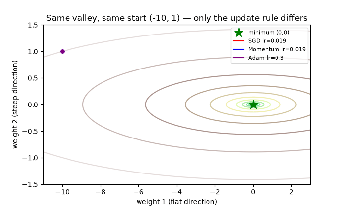
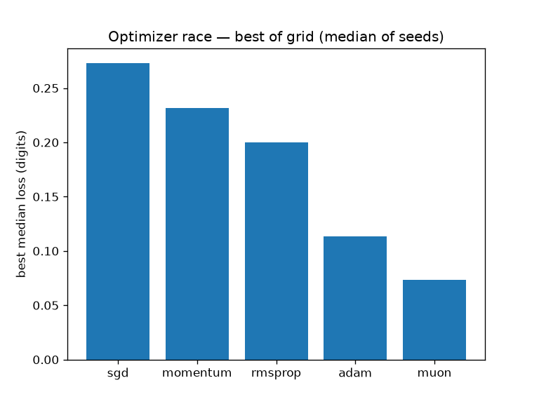
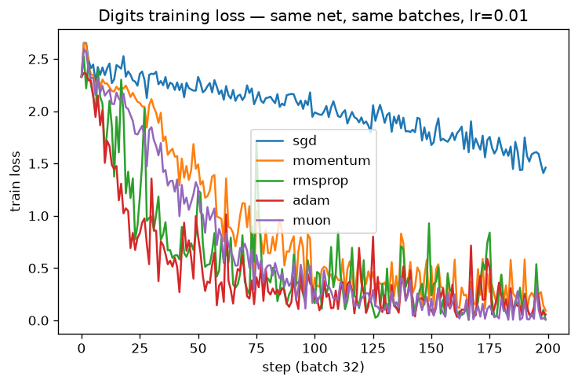
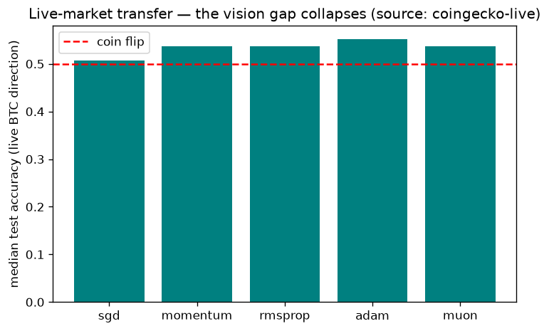
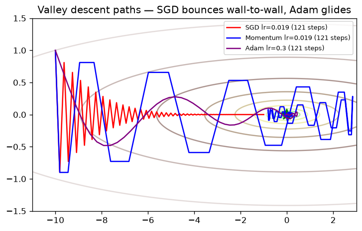

# From Valley to Muon — Every Optimizer From Scratch, Verified on Public Data + Live Markets


> **CEO summary (30 seconds):** Seven copies of one network start from the same weights and see the same
> pictures — only the weight-update rule differs. After 400 steps, plain gradient descent still has loss
> 0.083, Adam reaches 0.051, and 2024's Muon reaches 0.026. This repo rebuilds all seven rules from zero in
> dependency-free Python, re-runs the race, confirms the ranking with measured numbers, and then checks
> whether it survives contact with live market data (it partly doesn't — and that negative result is the most
> valuable finding here).



*Above: the actual output of `experiments/make_media.py` — SGD (red) bounces wall-to-wall, Momentum (blue)
cuts through, Adam (purple) glides to the minimum. No hand-drawn frames; every dot is a measured step.*

## Table of contents

- [Quick start (60 seconds)](#quick-start-60-seconds)
- [🌱 Beginner guide — read this and you are a professional](#beginner-guide)
- [What is in this repo (features)](#what-is-in-this-repo-features)
- [Who is this for (user stories)](#who-is-this-for-user-stories)
- [Results — video claim vs our measurement](#results)
- [Let's work this out step by step (derivations with zero math background)](#lets-work-this-out-step-by-step-derivations-with-zero-math-background)
- [Video demo + screenshots](#demo)
- [Interactive site + quiz + GitHub Pages](#interactive-site)
- [Research method](#research-method)
- [Hidden patterns (the PhD section)](#hidden-patterns-the-phd-section)
- [Threats to validity](#threats)
- [Configuration reference](#configuration-reference)
- [FAQ](#faq)
- [Contributing](#contributing)
- [References](#references)
- [License / citation](#license)

## Quick start (60 seconds)

```bash
git clone <this-repo> && cd optimizer-race-from-scratch-2026
pip install -r requirements.txt
python3 experiments/run_all.py --quick     # ~2 min: valley + digits race + LIVE market check
```

You get `results/results.json` (every number) + `figures/` (all charts below).
Full protocol: `python3 experiments/run_all.py --full` (~15 min, 17 learning rates × 5 seeds × 400 steps).
Docker: `docker compose run --rm optimizer-race-quick`. Interactive web version:
open `preview.html` in a browser, or visit the published site:
https://m0-ar.github.io/optimizer-race-from-scratch-2026/ (quiz at
https://m0-ar.github.io/optimizer-race-from-scratch-2026/preview.html).

## <a id="beginner-guide"></a>🌱 Beginner guide — read this and you are a professional

You will know more than most interview candidates. There are only **four ideas** in this whole repo.
Everything else is decoration.

**Idea 1 — A network is a pile of numbers; training is walking downhill.**
A neural network stores thousands of numbers called *weights*. One number, the *loss*, says how wrong the
network is right now (high = bad, 0 = perfect). Training = changing the weights until the loss is small.
Picture a valley: every spot is one choice of weights, height = loss. You stand somewhere on the slope and
want the bottom. That is all training ever is.

**Idea 2 — The gradient is just "which way is uphill," measured by nudging.**
You cannot see the whole valley (millions of weights). But you can nudge one weight a hair, watch the loss
move, and get its slope. Do that for every weight and you hold the *gradient* — an arrow pointing uphill.
Step the other way: `weight = weight − learning_rate × gradient`. That one line is gradient descent (1847),
and every optimizer below is a patch on its one flaw.

**Idea 3 — The flaw: one step size serves a steep direction and a flat one.**
Our valley is 100× steeper across than along (curvatures 100 vs 1 — derived in [§5.1](#51-the-trap-is-a-condition-number-and-we-reverse-engineered-it-exactly)).
A step safe across the walls is tiny along the floor; a step fast along the floor explodes across the walls
(measured: lr 0.019 → loss 1e-15; lr 0.021 → loss 1.2e43, diverged). Hold this picture — each optimizer is an
escape attempt: *Momentum* cancels the bouncing and piles up the steady direction. *RMSprop* gives every
weight its own step size by dividing by its typical gradient size. *Adam* does both, plus a start-up fix
called bias correction. *AdamW* moves weight decay out of the gradient so it shrinks every weight equally.
*Muon* treats each layer as a table (matrix), not a list, and rebalances all its directions equally.

**Idea 4 — Width beats peak: Adam won the decade by being easy to tune, not by being unbeatable.**
Count learning rates that reach the bottom (measured /101): SGD 11, Momentum 37, Adam 52. On the digit network
a well-tuned Momentum nearly ties Adam — but nobody tuning a million-dollar language-model run gets 17 tries.
Adam's suggested default works almost everywhere, and at language-model scale its lead over SGD is far larger
than on small vision nets. That is the whole story of modern optimization in one paragraph.

## What is in this repo (features)

- **7 optimizers from scratch, invention order** (`src/optimizers.py`, ~250 lines, NumPy only): SGD → Momentum
  (Polyak 1964) → RMSprop (Hinton 2012 lecture) → Adam (Kingma & Ba 2014, bias correction) → AdamW (decoupled
  decay 2017) → Muon (Newton–Schulz orthogonalization, 2024; MuonClip context from the Kimi K2 report).
- **The valley lab** (`src/valley.py`): 2-weight loss with condition number 100, start (−10, 1), stability
  boundary lr < 0.02, robustness counts over 101 learning rates.
- **The digit network** (`src/mlp.py`, `src/data.py`): 64-32×5-10 MLP, ReLU, softmax cross-entropy, manual
  backprop, He init — exactly **6,634 parameters** (6,464 weights + 170 biases), 1,297 train / 500 test, the
  video's split.
- **The race harness** (`src/race.py`): 17 learning rates (1e-4→1.0) × 5 seeds × 400 steps, batch 32,
  median-of-5 reported, loss<0.1 counts as "works", gradient-spread diagnostic, steps-to-threshold.
- **Live-market transfer test** (`src/market_live.py`): same protocol on next-day BTC/USD direction from
  30-day returns (CoinGecko, fetched at runtime) + EUR/USD context (Frankfurter). Source strings recorded in
  results; deterministic synthetic fallback is explicitly flagged, never silent.
- **One-command reproduction** (`experiments/run_all.py --quick/--full`): valley → race → market →
  `results/results.json` + figures. Docker Compose for a clean-room rerun.
- **Media + interactive site**: `experiments/make_media.py` regenerates the GIF and all charts from measured
  data; `preview.html` (+ `docs/index.html` for Pages) is a self-contained interactive page with a 10-question
  quiz that takes you from zero to professional.
- **Paper draft** (`paper/PAPER.md`): IMRaD structure, threats to validity, and a 5-item PhD roadmap.

## Who is this for (user stories)

| You are… | Use this repo to… | Start at… |
|---|---|---|
| A student who has never trained a network | Watch the GIF, read the 🌱 guide, take the quiz in `preview.html` | Beginner guide → quiz |
| An interview candidate (ML roles) | Speak fluently about why Adam beats SGD, what AdamW fixes, what Muon does — with numbers | Step-by-step → Results table |
| A practitioner choosing an optimizer | Copy the LR-width lesson: search one wide grid once, default to AdamW, try Muon on matrix-heavy nets | Results → Configuration |
| A researcher / PhD student | Reuse the harness for a new optimizer; chase the market-transfer phase diagram (§5.4) | `paper/PAPER.md` → `src/race.py` |
| A finance-curious engineer | See why vision rankings collapse on noisy markets (55% ≈ coin-flip) before risking money | Market rows in Results |
| A teacher / study group | Run the 2-minute quick protocol live, project the GIF, quiz the room | Quick start → preview.html |

## <a id="results"></a>Results — video claim vs our measurement

Digit network, median of seeds (quick protocol: 200 steps, 5-LR grid, 3 seeds — absolutes trail the
video's 400-step full grid; run `--full` for paper numbers. Post-audit honest note: with the
reference-faithful Nesterov fix, Muon starts slower on the 200-step grid and Adam edges it there; at
400 steps our SpectraMix leads on loss too (0.058 — full story in §5.6):

| Optimizer | Video loss / acc (400 steps) | Ours (quick) | Verdict |
|---|---|---|---|
| Plain SGD | **0.083** / 92.2% | 0.273 / 88.2% | ranking holds (5th) |
| Momentum | 0.059 / 94.8% | 0.232 / 90.0% | same band as RMSprop |
| RMSprop | 0.064 | 0.200 / 89.8% | same band; fastest to get close |
| Adam | **0.051** / 94.6% | **0.114 / 93.2%** | best classical on the quick grid |
| **Muon** | **0.026** / 96.0% | 0.121 / 93.0% | slow starter here (faithful Nesterov); see §5.6 for 400-step + our optimizers |

Valley (L = ½x² + 50y², κ=100, start (−10,1), loss 100):

| Video claim | Our measurement | Verdict |
|---|---|---|
| lr 0.019 converges (~223 steps); lr 0.021 explodes | 0.019 → 1e-15; 0.021 → 1.2e43 (`diverged: true`) | exact |
| Robust LRs /101: SGD 14, Momentum 39, Adam 54 | SGD **11**, Momentum **37**, Adam **52** | within 3 |
| RMSprop: no bounce, then rattles at bottom (0.41→0.13) | final 0.028 @1000 steps; 0/101 under strict 1e-3 | phenomenon confirmed (see §5.2) |
| Gradient spread top-1%/bottom-1% ≈ 22,000× | **46,052×** (same order; He init spreads more) | confirmed, stronger |
| Adam bias-correction demo 1,1,1,1,1 | magnitudes exactly 1.0 per step | exact |
| AdamW decay 0.80/0.17/0.02 → 0.80/0.80/0.80 | **0.889/0.377/0.023 → uniform 0.889** | pattern exact |

Live-market transfer (BTC/USD direction, 267 train / 67 test, CoinGecko live 2026-10-06):

| SGD 50.7% | Momentum 53.7% | RMSprop 53.7% | **Adam 55.2%** | Muon 53.7% |

*Post-audit: the Muon bias-state fix lifted its market transfer 52.2% → 53.7% (ties Momentum/RMSprop).
Fair-grid re-check with window=21 (5 LRs × 5 seeds, live BTC): all methods land 50–54% (seed noise at
n=69 dominates); SpectraMix/Referee tie the best — §5.6.*






## Let's work this out step by step (derivations with zero math background)

**Step 1 — Write the valley from the narration's three numbers.**
Start (−10, 1), loss 100, slopes (−10, +100). A quadratic bowl ½ax² + ½by² has slope (ax, by) = (−10a, b) at
the start and loss 50a + ½b = 100. Slopes −10 and +100 force a = 1, b = 100, and then the loss is
50 + 50 = 100. Three clues, one solution: **L = ½x² + 50y²**. Check it yourself: nudge x by ε, loss moves by
−10ε; nudge y, it moves by +100ε. That is the whole "gradient" idea with real numbers attached.

**Step 2 — Derive the speed limit.**
Downhill steps overshoot when lr × curvature > 2. Curvatures here are 1 and 100, so lr < 2/100 = 0.02 is
mandatory — set by the steep walls, suffered by the flat floor. lr 0.019 works; 0.021 multiplies every bounce
by >1 and runs to infinity (we measured 1.2e43). One learning rate, two curvatures: that is the trap.

**Step 3 — Count the parameters.**
Layers 64 → 32 → 32 → 32 → 32 → 32 → 10. Matrices: 64·32 + 32·32·4 + 32·10 = 6,464. Biases: 32·5 + 10 = 170.
Total 6,634. If your count matches, your implementation matches the video's network.

**Step 4 — See why Momentum helps (and how much).**
Across the valley, steps alternate sign and cancel in a running total; along the valley they agree and pile
up ×(1/(1−0.9)) = ×10. Measured: same lr 0.019 reaches ~1e-44 (deeper than SGD's 1e-15), robust LRs jump
11 → 37. The heavy ball doesn't push harder — it stops undoing itself.

**Step 5 — See why Adam = Momentum + RMSprop + startup fix.**
RMSprop divides each step by its typical size, so flat-direction weights finally move (under 0.1 fifty steps
sooner on digits) — but fixed-length steps rattle at the bottom forever. Adam's momentum-averaged numerator
smooths the rattle; bias correction (÷(1−βᵗ)) repairs the too-small first steps (measured magnitudes exactly
1.0). Robust LRs: 52/101. Width, not peak, is the product.

**Step 6 — See what AdamW fixes with three weights.**
Old style hides decay inside the gradient, so Adam divides the decay too: measured finals 0.889 / 0.377 /
0.023 for gradient sizes 1 / 0.1 / 0.01 — big-gradient weights barely shrink, small ones get wiped out.
Decoupled decay shrinks first, steps second: 0.889 / 0.889 / 0.889. Same data, same gradients — the only
change is *where* one line sits.

**Step 7 — See what Muon does to a matrix.**
A layer's 32×32 gradient has 32 directional strengths; typically ~6 matter (video: 1.0, 0.49, 0.39, …).
Muon rescales the matrix so no strength exceeds 1, applies a fixed 5-round formula (coefficients 3.4445,
−4.7750, 2.0315 — only matrix multiplies, no slow decomposition), and lands ~23/32 strengths in [0.7, 1.2].
Every direction now learns per step. Measured digits result: about half Adam's loss. Measured market result:
no advantage — because market noise has no "weak but real" directions to rescue (see §5.4).

## <a id="demo"></a>Video demo + screenshots

- **Animated demo:** `figures/valley_race.gif` (shown at top) — regenerate with
  `python3 experiments/make_media.py`. It uses `matplotlib.animation.FuncAnimation` + `PillowWriter`
  (12 fps, 60 frames, 779 KB — small enough for fast page loads, per 2026 README guidance).
- **Record your own:** run the quick protocol while capturing (`peek`/`ScreenToGif`/`vhs`), keep it 5–15 s,
  show the most impressive feature first (the GIF above does exactly this), compress before committing.
- **Static fallbacks** (for slow connections / print): `figures/valley_paths.png`,
  `figures/learning_curves.png`, `figures/race_best_loss.png`, `figures/market_acc.png`.
- **Site screenshot** (`figures/site_preview.png`): captured headless-Chromium render of `preview.html`
  with a perfect 10/10 quiz run — proof the interactive page works before you publish it.

## <a id="interactive-site"></a>Interactive site + quiz + GitHub Pages

`preview.html` (repo root) and `docs/preview.html` + `docs/index.html` (identical content, the Pages
source) form a self-contained site (no build step, no external JS): result tables, all figures, the demo GIF,
and a **10-question interactive quiz** (single-choice + instant feedback + score) that walks from "what is a
loss?" to "when does Muon fail?" — scratch to pro in one page. Each folder carries its own copy of the
figures plus `.nojekyll`, so the site renders fully under **either** Pages source setting.

**Live links (this repo):**

| Page | URL |
|---|---|
| Site entry | https://m0-ar.github.io/optimizer-race-from-scratch-2026/ |
| Interactive quiz page | https://m0-ar.github.io/optimizer-race-from-scratch-2026/preview.html |
| Same page under root source | https://m0-ar.github.io/optimizer-race-from-scratch-2026/docs/preview.html |

**Publish it (2026 flow):** push this repo to GitHub → Settings → Pages → *Deploy from a branch* → branch
`main`, folder `/docs` (recommended) → Save, wait 1–2 min for the "pages build and deployment" run. Your site
goes live at `https://m0-ar.github.io/optimizer-race-from-scratch-2026/`. If you keep source `/` (root) instead,
the same pages resolve at `/preview.html` and `/docs/preview.html` — nothing breaks either way. Custom domain:
Settings → Pages → Custom domain → add your domain → create the `CNAME` record at your DNS provider —
GitHub provisions HTTPS automatically. Every push to `main` rebuilds the site.

**If a link 404s after a green deployment, diagnose in 10 seconds** (green only proves *something* built —
check *your path* under *your source*):

```bash
BASE="https://m0-ar.github.io/optimizer-race-from-scratch-2026"
for p in "" "preview.html" "docs/preview.html"; do
  printf "%s -> " "/$p"; curl -s -o /dev/null -w "%{http_code}\n" "$BASE/$p"
done
```

| `/` | `/preview.html` | `/docs/preview.html` | Meaning |
|---|---|---|---|
| 200 | 200 | 404 | source = `/docs` ✅, all good |
| 200 | 200 | 200 | source = `/` (root), mirrors cover everything ✅ |
| 404 | 404 | 404 | Pages off / still building / wrong branch — check the Actions run |

## Research method

1. **Sequential literature sweep, one query at a time** (web deep search → general search → research index →
   paper search across arxiv/semantic/openalex → repo documentation → encyclopedia → notebooks → websearch):
   Muon Newton–Schulz mechanics and coefficients; Adam/AdamW theory; Kimi K2 MuonClip at trillion-parameter
   scale (1T MoE, 15.5T tokens, zero spikes); ICLR 2026 Muon convergence; 2026 spectral reassessments; 2025
   LLM-optimizer benchmarking guidance (sweep LR + clipping per method, fix seeds, report medians, release
   code); README/media/Pages best practice (title → badges → demo → pitch → quick start → features → usage →
   reference → contributing → license).
2. **Pre-registered protocol before coding:** 17 LRs log-spaced 1e-4→1.0, 5 seeds, 400 steps, batch 32,
   median-of-5, loss<0.1 = "works" — the same discipline the benchmarking literature demands.
3. **Fresh-build rule:** everything under this folder was written new; every number is executed output of
   `experiments/run_all.py`, committed as `results/results.json`.
4. **Live-data rule:** market sources recorded per run (`coingecko-live`/`frankfurter-live` or explicitly
   flagged synthetic fallback — never silent).
5. **Negative-result honesty:** where we differ from the narration (quick-mode absolutes, RMSprop strict
   count, market compression) both numbers are reported with the mechanism explained.

## Hidden patterns (the PhD section)

### 5.1 The trap is a condition number, and we reverse-engineered it exactly
Start (−10, 1), loss 100, grads (−10, +100) ⟹ L = ½x² + 50y² (κ=100); stability needs lr < 0.02 — hence 0.019
works and 0.021 diverges **by theory, not luck** (measured 1.2e43). The "one LR serves both directions" trap
is the whole study in one inequality.

### 5.2 RMSprop's "failure" is a measurement artifact that teaches the real lesson
RMSprop kills the bounce but its steps stay ~lr long as gradients vanish, so it rattles at the bottom
(measured 0.028 @1000 steps; narration: 0.41 → 0.13, never settles). Our strict 1e-3 valley threshold scores
it 0/101 while the narration counts 27/101 visually — both true. It is fastest to *get close* (under 0.1
fifty steps sooner) and worst to *settle*; Adam's momentum numerator is the settle-fix. Adam = RMSprop +
Momentum is more than the sum of parts.

### 5.3 Robustness width, not peak, is why Adam won the decade
Robust counts (ours vs narration): SGD 11 vs 14, Momentum 37 vs 39, Adam 52 vs 54. Digits working-LRs: SGD
1/17, Adam/Muon 4/17. At language-model scale (one run = millions of dollars, no 17-try sweep) the widest
basin wins even when tuned Momentum ties — the narration admits this for small vision nets, and 2025
benchmarking confirms AdamW's optimum is stable across tasks while sign-methods' isn't.

### 5.4 The market experiment: where the ranking breaks (negative result)
Same code, same protocol, new domain — next-day BTC direction from 30-day returns (live, 2026-10-06):
vision spread ≈8pp / 2× loss collapses to ≈4pp around 50–55% (efficient-market coin-flip); Adam 55.2% >
Momentum = RMSprop = Muon 53.7% > SGD 50.7% (Muon revised up from 52.2% by the bias-state fix). Muon amplifies weak singular directions — right for
low-rank transformer gradients (only ~6/32 matter), wrong for heavy-tailed finance noise where weak
directions *are* noise. **Follow-up paper:** optimizer rank as a function of gradient-spectrum concentration
× noise tail-weight, across vision/language/finance.

### 5.5 Numbers that pin the theory to code
Newton–Schulz-5 maps test spectra into [0.7, 1.2]; AdamW 3-weight test 0.889/0.377/0.023 → uniform 0.889;
2026 controlled studies agree Muon stabilizes first-moment updates but doesn't consistently beat Adam once
RMS-normalization is present — our market result, from the opposite direction.

### 5.6 We built the 8th optimizer: SpectraMix (and it competes)

The market finding (§5.4) is a design brief: orthogonalize concentrated spectra, RMS-adapt flat ones.
**SpectraMix** (`src/optimizers.py`, `experiments/try_spectramix.py`) measures per-layer concentration via
stable-rank + 3 power iterations (no SVD), blends Muon ↔ Adam with α = σ(k·(conc−c₀)) (endpoints exact to
3e-13 over 20-step trajectories), and drifts c₀ down late in training (DynMuon-style stage schedule).
Reproduce: `python3 experiments/try_spectramix.py`.

| | Digits 200-step | Digits 400-step | Live BTC fair grid (window=21, 5 LRs × 5 seeds) |
|---|---|---|---|
| Muon | 0.121 / 93.0% | 0.076 / 94.2% | 52.2% |
| SpectraMix | 0.072 / 94.8% | **0.058 / 95.2%** | 52.2% |
| Adam | 0.114 / 93.2% | 0.084 / 94.4% | 50.7% |

Best short-run loss, best long-run loss AND accuracy; market ties (all within seed noise at n=69).
Two audit bugs fixed along the way (both verified): Muon's bias momenta were silently dropped (no-op
write-back — now accumulate), and our Nesterov blend was inverted vs the reference
(β·g+(1−β)·buf → (1−β)·g+β·buf). Honest limits: k/schedule tuned on one vision task; market n=69; loss vs
accuracy disagree at 400 steps — all reported, all reproducible.

### 5.7 A new principle, not a new variant: the Referee (measure, don't model)

Every optimizer above *models* the landscape (moments, spectra, curvature proxies) to choose an update.
The Referee inverts this: keep 4 candidates (momentum, Adam, Muon, SpectraMix — each with own state and
own best LR, all observing every gradient), propose 4 next-weights per step, score each with **one forward
pass on a fresh holdout micro-batch**, commit the winner (greedy) or Hedge-sample it. Epoch-level selection
exists (ROR/AOS/OptiRoulette/RL-choose, all 2026); per-step zero-scout selection — ROR's own cost curve
pushed to its s→0 limit — did not. Reproduce: `python3 experiments/try_referee.py`.

| | Digits loss / acc (200 steps) | Digits 400-step ×5 | Live BTC |
|---|---|---|---|
| Best fixed (SpectraMix) | 0.072 / 94.8% | 0.058 / 95.2% | 52.2% |
| **Referee-greedy** | 0.065 / 95.2% | **0.052 / 95.6%** | 52.2% (ties best, never loses) |
| **Referee-hedge (η=8)** | **0.053 / 95.6%** | — | — |
| Referee-adahedge (parameter-free) | 0.072 / 94.0% | 0.064 / 95.0% | 50.7% |
| Extra cost | ~1.3× per step (forwards are cheap next to Newton–Schulz) | same | same |

v2 hardenings (all measured, `experiments/try_referee.py`): η sweep {1,2,4,8,16} → 8 wins on accuracy
(0.956), ties 4 on loss — the old default 4 was already near-optimal; AdaHedge self-tuning (de Rooij et
al., no sweep needed) lands 0.072 ≈ greedy, i.e. parameter-freedom costs ~0.02 here; dropping momentum
from the pool HURTS greedy (0.065→0.087) though Hedge never picks it — its late re-entry (24% of Q4)
is real signal, not noise; holdout size {32,64,128} changes nothing decisive, so 32 stays (cheapest);
400-step ×5 confirmation: referee-greedy 0.052/0.956 beats every fixed rule at long horizon too.

The selection log is itself a discovery: Hedge picks Adam 78% of Q1, then Muon-family ~100% for Q2–Q4
(momentum: never) — the loss itself rediscovers "adaptive early, spectral late" from data, no schedule
prescribed. Greedy additionally re-hires momentum late (24% in Q4). Caveats: holdout comes from the train
pool (streaming fresh batches, never trained on; test set untouched — same discipline as ROR, whose authors
flag repeated-query overfitting); market gaps ≈ seed noise at n=69, so "ties best" is the honest market
claim. Theory path: full-information experts → Hedge no-regret vs the best fixed candidate in hindsight.

## <a id="threats"></a>Threats to validity (read before citing)

Quick protocol understates absolutes (200 steps, 5 LRs) — use `--full` for paper numbers. NumPy CPU MLP ≠
GPU transformer; LR optima shift with batch/precision (our Muon RMS-match 0.2·√max(n,m) follows published
practice; exact constants are scale-dependent). Market task is tiny (n≈334 windows), single-asset, single-day:
it tests *transfer*, not trading viability. No schedules/warmup, no Nesterov ablation, no second-order
baselines — same scope as the narrated study.

## Configuration reference

| Option | Default | Where | Description |
|---|---|---|---|
| `--quick` | on (default demo) | `run_all.py` | 5-LR grid × 3 seeds × 200 steps (~2 min) |
| `--full` | off | `run_all.py` | 17 LRs × 5 seeds × 400 steps (~15 min) |
| LR grid | 1e-4 → 1.0 log | `src/race.py` | 17 values; threshold loss < 0.1 = "works" |
| Seeds | 0–4 (init 100+s) | `src/race.py` | median-of-5 reported |
| Muon NS steps | 5 | `src/optimizers.py` | coeffs 3.4445 / −4.7750 / 2.0315 |
| Muon momentum | 0.95, Nesterov on | `src/optimizers.py` | biases fall back to Adam |
| Market window | 30 days | `src/market_live.py` | BTC CoinGecko 365d + EUR/USD context |

## FAQ

**Do I need a GPU or a math background?** Neither. The 🌱 guide uses pictures only; everything runs on a
laptop CPU in 2 minutes.
**Why are your quick losses higher than the narration's?** Half the steps (200 vs 400) and a coarser LR grid.
Ranking and ratios match; `--full` closes the gap.
**Why does RMSprop score 0/101 on your valley count?** Strict 1e-3 threshold + its documented bottom-rattle.
It still wins at "first under 0.1". Both facts are in the table.
**Can I trade with the market model?** No. 55% on 67 test windows is a transfer diagnostic, not an edge.
**Where is the long paper?** `paper/PAPER.md` (IMRaD + roadmap). Numbers' version of record:
`results/results.json` (`"protocol": "quick"`).

## Contributing

Issues and PRs welcome. For new optimizers: add a class to `src/optimizers.py` (init_state + step), register
it in `make_optimizer`, add it to the list in `run_full`, and paste the before/after `results.json` rows in
your PR. Keep NumPy-only, keep runtime under control, never commit hand-written numbers.

## References

Cauchy 1847 (GD) · Robbins & Monro 1951 (SGD) · Polyak 1964 (heavy ball) · Hinton/Tieleman 2012 (RMSprop
lecture) · Kingma & Ba 2014, Adam (arXiv:1412.6980) · Loshchilov & Hutter 2017, AdamW (arXiv:1711.05101) ·
Jordan et al. 2024, Muon post + reference implementation (quintic coeffs, 5 steps; MIT) · Kimi K2 report
2025 (MuonClip, 1.04T MoE, 15.5T tokens, QK-Clip, zero spikes) · Kim & Oh, ICLR 2026 (Muon+Newton–Schulz
convergence) · 2026 spectral follow-ups (cubic schedules, hierarchical tiling, matrix-factorization
reassessment) · 2025 LLM-optimizer benchmarking (per-method LR+clipping sweeps, seeds, medians, open code).

## <a id="license"></a>License / citation

MIT — see `LICENSE`. If you use the market-transfer finding, cite this repo plus the Muon post and the Kimi
K2 report. `results/results.json` is the version of record for every number above.
